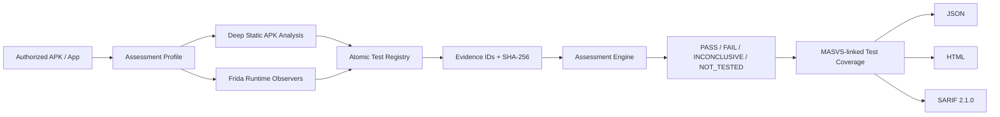

# MobileAuditKit

MobileAuditKit is a defensive, OWASP-aligned mobile application security assessment toolkit for **authorized Android testing**. It combines safe Frida runtime observation, deep APK static analysis, profile-driven assessment orchestration, atomic test traceability, redacted evidence, and JSON/HTML/SARIF reporting.

> Use MobileAuditKit only on applications and devices you own or have explicit permission to assess.

## v0.4.0 — Static Intelligence & Traceability

v0.4.0 extends the v0.3 Assessment Engine with deeper static analysis and evidence traceability.

### New in v0.4.0

- **Deep APK static analysis** using Android SDK `apkanalyzer`, standard ZIP inspection, and optional `apksigner` metadata.
- **Atomic Test Registry** with stable project-local `MAK-AND-*` and `MAK-DYN-*` IDs.
- **Evidence provenance** with deterministic evidence IDs and SHA-256 hashes.
- **APK artifact identity** using APK SHA-256 and file-size metadata.
- **MASVS-linked test coverage matrix** showing PASS / FAIL / INCONCLUSIVE / NOT_TESTED execution without presenting it as a compliance score.
- **SARIF 2.1.0** output for code-scanning pipelines.
- **CI hardening** with Python 3.11/3.12/3.13 tests, Ruff, mypy, coverage floor, JavaScript syntax validation, wheel/resource verification, advisory dependency audit, CodeQL, and Dependabot.

## Assessment status model

Each enabled module and atomic test uses one of four statuses:

- **PASS** — the defined test was conclusively evaluated and its failure condition was not met within the exercised scope.
- **FAIL** — the atomic failure condition was met.
- **INCONCLUSIVE** — testing produced evidence but additional context or reliable execution is required before a pass/fail conclusion.
- **NOT_TESTED** — a required input/tool was unavailable or that atomic check could not be executed.

`PASS` is deliberately scoped. It does **not** certify MASVS compliance and does not prove the absence of vulnerabilities outside the tested paths and checks.

## Deep APK static checks

The `apk-config` module now evaluates or inventories:

- `android:debuggable`
- `android:usesCleartextTraffic`
- Network Security Configuration (`cleartextTrafficPermitted`, production user-added CA trust anchors)
- `android:allowBackup`, `fullBackupContent`, and `dataExtractionRules`
- exported activities, services, receivers, and providers
- custom permission protection levels
- browsable deep-link schemes
- FileProvider exported state
- target/min SDK metadata
- dangerous/runtime permission inventory for contextual privacy review
- bounded packaged-text secret-format indicators without retaining matched values
- bounded `http://` indicators without retaining endpoint values
- APK SHA-256 / file size
- native `.so` libraries and ABIs
- optional signing-certificate SHA-256 fingerprints via `apksigner`
- DEX-defined non-application package namespaces for supply-chain inventory

The static engine intentionally avoids overclaiming. For example, an exported component without a manifest permission may be marked **INCONCLUSIVE** until code-level sensitivity and caller authorization are reviewed.

## Atomic Test Registry

```bash
mobileauditkit tests
mobileauditkit tests --module apk-config
```

Registry data lives under `src/mobileauditkit/registry/tests.yaml`. Each definition includes the test ID, engine, module, title/description, default severity, framework mappings, and registry review metadata. MobileAuditKit IDs are project-local identifiers; OWASP mappings should be revalidated as OWASP MAS evolves.

## Evidence provenance

Each structured evidence item contains:

```text
evidence_id
source
module
test_id
evidence_type
sha256
timestamp
redacted data
```

Evidence IDs are deterministic for the same redacted evidence payload. For packaged-secret and HTTP-string checks, **matched secret/endpoint values are discarded**; reports contain only indicator type/count and APK-internal file path.

## Install

```bash
python -m venv .venv
source .venv/bin/activate  # Windows: .venv\Scripts\activate
pip install -e .
mobileauditkit doctor
```

Runtime testing requires ADB plus compatible Frida client/server versions on an authorized device or emulator. Deep APK inspection requires `apkanalyzer`; `apksigner` is optional enrichment.

## Assessment usage

```bash
mobileauditkit profiles
mobileauditkit tests

mobileauditkit scan \
  --package com.example.testapp \
  --apk sample.apk \
  --profile baseline \
  --seconds 20

mobileauditkit scan --apk sample.apk --profile static

mobileauditkit inspect-apk sample.apk \
  --json-report reports/static.json \
  --html-report reports/static.html
```

## SARIF

```bash
mobileauditkit scan \
  --apk sample.apk \
  --profile static \
  --sarif-report reports/mobileauditkit.sarif \
  --sarif-location app/src/main/AndroidManifest.xml
```

`--sarif-location` should be a repository-relative file that best represents where packaged configuration can be remediated. GitHub code scanning requires a result location to display an alert. SARIF output contains non-INFO findings and includes rule IDs, severity, fingerprints, evidence IDs, and framework mappings.

## Consolidated assessment output

`mobileauditkit scan` writes `reports/assessment.json` and `reports/assessment.html` by default. v0.4 adds the atomic test registry version/review date, APK SHA-256, atomic-test matrix, MASVS-linked test coverage, finding-to-evidence references, and an evidence appendix with hashes and redacted data.

## Runtime modules

- **crypto** — observes algorithm/mode selection; never captures keys, IVs, plaintext, or ciphertext.
- **storage** — observes storage APIs; never dumps values or databases.
- **network** — observes transport/TLS/pinning configuration; never disables validation or pinning.
- **authentication** — observes biometric configuration; never bypasses authentication.
- **webview** — observes security-relevant WebView configuration; does not inject content.
- **privacy** — observes privacy-relevant APIs without collecting user content.
- **resilience** — observes root/debug detection without suppressing results.

## Safety boundary

MobileAuditKit does **not** implement universal SSL-pinning bypass, biometric bypass, root-detection bypass, credential interception, session hijacking, transaction manipulation, malware/persistence, or customer-data extraction. Runtime hooks call original API implementations and reports are redacted before persistence.

## Architecture



## OWASP alignment

The project uses **OWASP Mobile Top 10 2024** as a high-level risk taxonomy and **OWASP MASVS / MASWE / MASTG** as granular references. MASTG v2 atomic-test structure is reflected in MobileAuditKit's Observation/Evaluation model. Mappings are traceability aids, not automatic compliance certification.

## CI and project assurance

Feature branches and pull requests run pytest on Python 3.11/3.12/3.13, Ruff, mypy, coverage, Frida JavaScript syntax checks, wheel/sdist build, install-from-wheel resource verification, and an advisory `pip-audit`. CodeQL analyzes Python and JavaScript/TypeScript on `main`, PRs, and weekly; Dependabot monitors Python and Actions dependencies.

## Limitations

- Dynamic coverage depends on application paths exercised during the observation window.
- A static indicator is not automatically an exploitable vulnerability.
- Exported-component sensitivity generally requires code and authorization-flow review.
- Packaged-text scanning is bounded and can miss obfuscated, encrypted, binary, generated, or unusually large content.
- Namespace inventory does not identify exact dependency versions or known vulnerabilities; SBOM/dependency resolution is planned for a later release.
- A module/test PASS is scoped to its defined Observation/Evaluation criteria and is not a MASVS compliance verdict.

## Development

```bash
pip install -e '.[dev]'
ruff check .
mypy src/mobileauditkit
pytest
python -m build
```

## License

Apache-2.0. OWASP names and identifiers remain the property of their respective project/Foundation; consult OWASP licensing for reuse of OWASP content.
