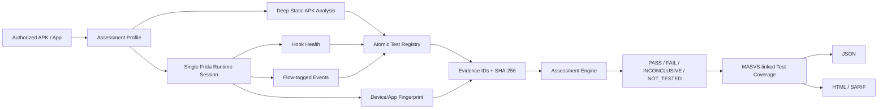

# MobileAuditKit

MobileAuditKit is a defensive, OWASP-aligned mobile application security assessment toolkit for **authorized Android testing**. It combines deep APK static analysis with safe Frida runtime observation, atomic test traceability, redacted evidence, and JSON/HTML/SARIF reporting.

> Use MobileAuditKit only on applications and devices you own or have explicit permission to assess.

## v0.5.0 — Dynamic Assessment Orchestration

v0.5.0 brings the runtime side to the same evidence/traceability model introduced for static analysis in v0.4.

### New in v0.5.0

- **Single-session dynamic orchestration** — all enabled runtime observers load into one Frida session and share one observation window.
- **Atomic runtime tests** — module-level runtime summaries are split into specific `MAK-DYN-*` tests with explicit Observation/Evaluation semantics.
- **Hook-health telemetry** — each observer reports hook groups attempted/installed; absence of events cannot become PASS when coverage is degraded or unknown.
- **Flow markers** — label the exercised user journey with `--flow`, with start/end markers persisted as evidence.
- **Device/app fingerprinting** — bounded ADB metadata records app version, Android/API level, manufacturer/model, ABI, Frida version, and a one-way hash of the ADB serial. The raw serial is never persisted.
- **Scoped PASS semantics** — dynamic PASS requires sufficient hook health plus relevant runtime activity where the test depends on negative observation.
- **Backward compatibility** — `mobileauditkit run` remains a single-module observer; injected `observer=` integrations continue to work.

## Assessment status model

Each enabled module and atomic test uses one of four statuses:

- **PASS** — the defined test was conclusively evaluated and its failure condition was not met within the exercised scope.
- **FAIL** — the atomic failure condition was directly met.
- **INCONCLUSIVE** — additional context, hook coverage, or runtime activity is required before a pass/fail conclusion.
- **NOT_TESTED** — a required input/tool was unavailable or the check could not execute.

For runtime tests, `PASS` is additionally scoped to the named flow and available hook coverage. It is **not** a MASVS compliance certificate and does not prove absence of vulnerabilities in unexercised paths.

## Install

```bash
python -m venv .venv
source .venv/bin/activate  # Windows: .venv\Scripts\activate
pip install -e .
mobileauditkit doctor
```

Runtime testing requires ADB plus compatible Frida client/server versions on an authorized device or emulator. Deep APK inspection requires `apkanalyzer`; `apksigner` is optional enrichment.

## Runtime assessment

```bash
mobileauditkit scan \
  --package com.example.testapp \
  --profile runtime \
  --seconds 30 \
  --flow login
```

For a combined static + runtime assessment:

```bash
mobileauditkit scan \
  --package com.example.testapp \
  --apk sample.apk \
  --profile baseline \
  --seconds 30 \
  --flow login \
  --sarif-report reports/mobileauditkit.sarif
```

All enabled dynamic observers are loaded into one Frida session. The app is attached/spawned once, scripts are loaded once, and the tester exercises the named flow during a shared observation window.

## Hook health

Each runtime module records:

```text
state
script_loaded
signal_received
hooks_attempted
hooks_installed
security_event_count
error_count
observation
```

Typical states are `READY`, `DEGRADED`, `NO_SIGNAL`, `ERROR`, and `NOT_LOADED`.

For tests that rely on absence (for example, no cleartext HTTP or no weak symmetric cipher), MobileAuditKit does **not** infer PASS from silence. A scoped PASS requires healthy hooks and relevant covered API activity. Directly observed failing events can still produce FAIL even when unrelated hooks are degraded.

## Atomic runtime tests

The v0.5 registry decomposes runtime assessment into focused checks, including:

- deprecated hash algorithms
- broken symmetric cipher modes/configurations
- external/shared storage use
- local storage inventory
- cleartext HTTP observations
- TLS trust/hostname-validation API inventory
- certificate-pinning invocation presence
- biometric CryptoObject binding
- WebView local-resource settings
- WebView debugging
- JavaScript bridge exposure
- clipboard, logging, screenshot-protection, and location API observations
- root/debugger detection activity

Context-dependent observations are deliberately `INCONCLUSIVE` instead of being overstated. For example, an unbound biometric call or a JavaScript bridge needs application-context validation before being treated as a confirmed vulnerability.

## Runtime fingerprint

The consolidated report can include:

```text
fingerprint_id
package
app_version_name
app_version_code
android_version
api_level
manufacturer
model
abi
frida_version
device_id_hash
collection_errors
```

The ADB serial itself is not stored. Only a SHA-256-derived short identifier is persisted to correlate repeated authorized lab runs without retaining the raw device identifier.

## Flow markers

`--flow` labels the user journey that was exercised, for example:

```bash
--flow login
--flow biometric-auth
--flow profile-update
--flow logout
```

Each shared runtime session emits start/end flow markers. Runtime event evidence also carries the current flow label, making reports easier to reproduce and compare.

## Deep APK static checks

The v0.4 static engine remains available and evaluates/inventories manifest hardening, Network Security Configuration, backup/data-extraction rules, exported components, deep links, FileProvider, target SDK, packaged secret/HTTP indicators, signing metadata, native libraries, and DEX package namespaces.

```bash
mobileauditkit inspect-apk sample.apk \
  --json-report reports/static.json \
  --html-report reports/static.html
```

## Atomic Test Registry

```bash
mobileauditkit tests
mobileauditkit tests --module network
```

Registry data lives under `src/mobileauditkit/registry/tests.yaml`. MobileAuditKit IDs are project-local identifiers. OWASP mappings support traceability and should be periodically revalidated as OWASP MAS evolves.

## Evidence provenance

Every persisted runtime/static evidence item is redacted before deterministic hashing and includes:

```text
evidence_id
source
module
test_id
evidence_type
sha256
timestamp
redacted data
```

Fingerprint and flow-marker records use the same evidence pipeline.

## Consolidated outputs

`mobileauditkit scan` writes:

- `reports/assessment.json`
- `reports/assessment.html`
- optional SARIF 2.1.0 via `--sarif-report`

The report includes module status, hook health, atomic tests, MASVS-linked test coverage, runtime fingerprint, flow markers, findings, and evidence hashes.

## Runtime modules

- **crypto** — observes algorithm/mode selection; never captures keys, IVs, plaintext, or ciphertext.
- **storage** — observes storage APIs; never dumps values or databases.
- **network** — observes transport/TLS/pinning configuration; never disables validation or pinning.
- **authentication** — observes biometric configuration; never bypasses authentication.
- **webview** — observes security-relevant WebView configuration; does not inject content.
- **privacy** — observes privacy-relevant APIs without collecting user content.
- **resilience** — observes root/debug detection without suppressing results.

## Safety boundary

MobileAuditKit does **not** implement universal SSL-pinning bypass, biometric bypass, root-detection bypass, credential interception, session hijacking, transaction manipulation, malware/persistence, or customer-data extraction. Runtime hooks call original API implementations and reports are redacted before persistence.

## Architecture



## OWASP alignment

The project uses **OWASP Mobile Top 10 2024** as a high-level taxonomy and **OWASP MASVS / MASWE / MASTG** for granular traceability. The runtime evaluator follows an Observation/Evaluation approach and remains conservative where MASTG requires contextual or follow-up validation.

## CI and project assurance

Feature branches and pull requests run pytest on Python 3.11/3.12/3.13, Ruff, mypy, coverage, Frida JavaScript syntax checks, wheel/sdist build, install-from-wheel resource verification, dependency audit, and CodeQL.

## Limitations

- Dynamic coverage depends on the application paths exercised during the named flow.
- Hook health reports coverage of MobileAuditKit's configured hook groups, not exhaustive coverage of every framework/library implementation.
- Apps using native, custom, obfuscated, dynamically loaded, or unsupported APIs may require additional manual instrumentation.
- Positive presence checks (such as pinning/root/debug detection) confirm observation, not robustness/effectiveness.
- Context-sensitive observations may remain INCONCLUSIVE by design.
- A module/test PASS remains scoped and is not a MASVS compliance verdict.

## Development

```bash
pip install -e '.[dev]'
ruff check .
mypy src/mobileauditkit
pytest
python -m build
```

## License

Apache-2.0. OWASP names and identifiers remain the property of their respective project/Foundation; consult OWASP licensing for reuse of OWASP content.
