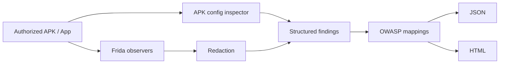

# MobileAuditKit

MobileAuditKit is a defensive, OWASP-aligned mobile application security assessment toolkit for **authorized Android testing**. It combines safe Frida runtime observation, APK configuration inspection, and structured JSON/HTML reporting.

> Use MobileAuditKit only on applications and devices you own or have explicit permission to assess.

## v0.2.0 modules

- **crypto** — observes algorithm/mode selection; never captures keys, IVs, plaintext, or ciphertext.
- **storage** — observes SharedPreferences, file, database, and external-storage APIs; never dumps values or databases.
- **network** — observes cleartext HTTP construction, TLS setup, hostname-verifier configuration, and certificate-pinning invocation; never disables TLS validation or pinning.
- **authentication** — observes platform/Jetpack `BiometricPrompt` and whether a `CryptoObject` is present; never bypasses authentication.
- **webview** — snapshots security-relevant WebView settings, JavaScript bridges, and debugging configuration; does not inject content.
- **privacy** — observes clipboard/log/location/screenshot-protection APIs without capturing clipboard content, log messages, or coordinates.
- **resilience** — observes root/debug detection checks without suppressing or changing their results.
- **apk-config** — parses the final AndroidManifest with Android SDK `apkanalyzer` and checks debuggable, backup, cleartext, and exported-component configuration.

## Safety boundary

MobileAuditKit does **not** implement universal SSL-pinning bypass, biometric bypass, root-detection bypass, credential interception, session hijacking, transaction manipulation, malware/persistence, or customer-data extraction. Runtime hooks call the original API implementation and reports are redacted before persistence.

## Install

```bash
python -m venv .venv
source .venv/bin/activate  # Windows: .venv\Scripts\activate
pip install -e .
mobileauditkit doctor
```

Runtime testing requires ADB plus compatible Frida client/server versions on an authorized device or emulator. APK inspection requires `apkanalyzer` from the Android SDK on `PATH`.

## Usage

```bash
mobileauditkit modules
mobileauditkit mappings masvs

mobileauditkit run \
  --package com.example.testapp \
  --module network \
  --seconds 20 \
  --json-report reports/network.json \
  --html-report reports/network.html

mobileauditkit inspect-apk sample.apk \
  --json-report reports/apk.json \
  --html-report reports/apk.html
```

## Architecture



## OWASP alignment

The project uses **OWASP Mobile Top 10 2024** as a risk taxonomy and **MASVS / MASWE / MASTG** as more granular control/testing references. Mapping files are packaged under `src/mobileauditkit/mappings/` with status dates because OWASP MAS is a living project. A mapping is evidence support, not automatic compliance certification.

Implemented references include MASTG v2 tests for cleartext traffic, WebView configuration, biometric event-bound authentication, root detection, debugging detection, backup, storage APIs, and broken encryption modes.

## Limitations

- Dynamic coverage depends on application paths exercised during the observation window.
- An observed API call is not automatically a vulnerability.
- Absence of an observed security/resilience API does not prove the control is absent.
- Manifest inspection does not replace source review, backend authorization testing, network testing, or a complete MASVS assessment.
- MASTG/MASWE identifiers and statuses should be revalidated when mappings are updated.

## Development

```bash
pip install -e '.[dev]'
pytest
ruff check .
```

## License

Apache-2.0. OWASP names and identifiers remain the property of their respective project/Foundation; consult OWASP licensing for reuse of OWASP content.
